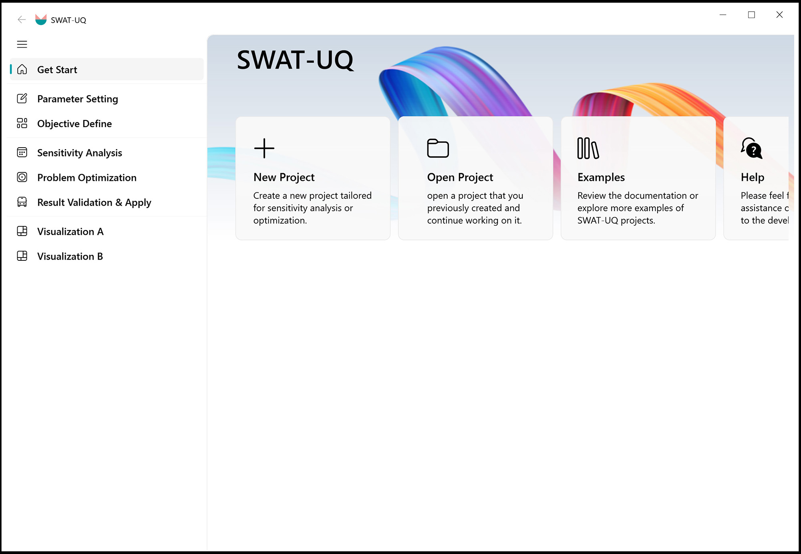

# SWAT-UQ ( Uncertainty Quantification for SWAT )

**SWAT-UQ:**  
This GUI interface is designed for parameter uncertainty quantification (UQ) of the **SWAT** model. Core functionalities are built upon [UQPyL](https://github.com/smasky/UQPyL), our publicly released Python package for UQ. Therefore, SWAT-UQ would provide full access to its features, such as sensitivity analysis, single-objective optimization, and multi-objective optimization. A key advantage of this program is that users do not need to worry coding; **it seamlessly automates the entire workflow from sensitivity analysis and parameter optimization to visualization**.

 

**Figure 1. SWAT-UQ Get Start Interface**

