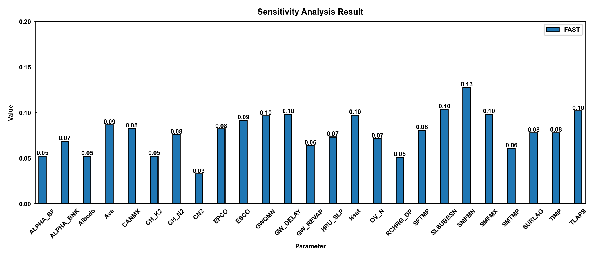
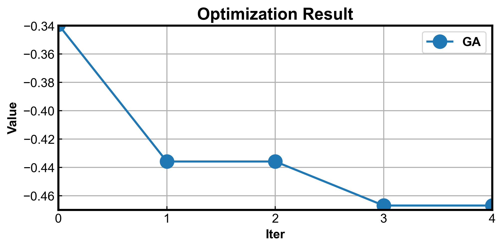
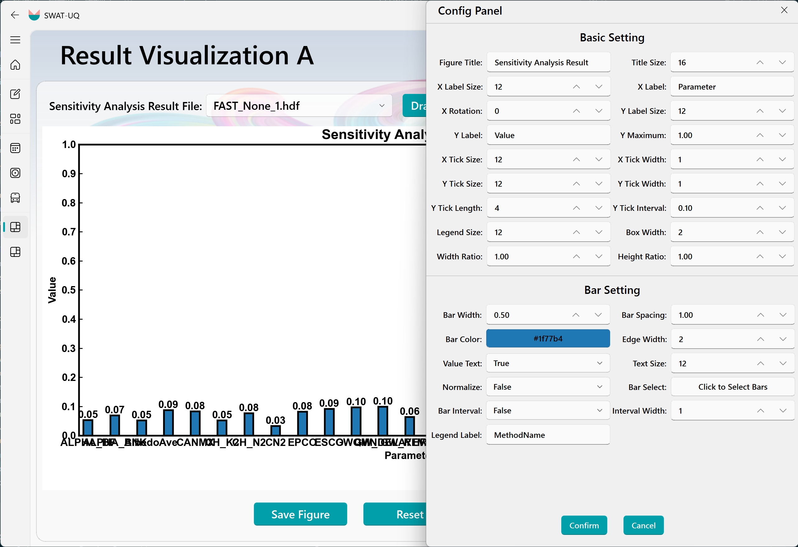
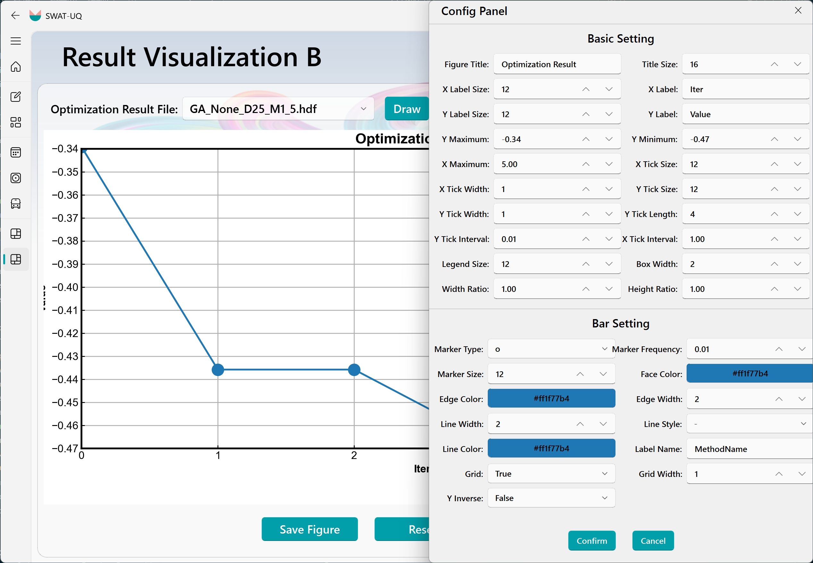

# SWAT-UQ: Uncertainty Quantification for SWAT

<p align="center"></p>

  

**SWAT-UQ** is an extend project of [UQPyL](https://github.com/smasky/UQPyL) - a comprehensive platform for uncertainty analysis and parameter optimization. This project aims to provide full integration of UQPyL and **Soil and Water Assessment Tool** (SWAT), enabling users to easily perform sensitivity analysis, single-objective optimization, and multi-objective optimization and so on. 

There are two available versions of SWAT-UQ, tailored to meet different user needs:
 - **SWAT-UQ-DEV (Develop Version)** - Designed for advanced users who require high flexibility and customization in building and managing their modeling workflows.
 - **SWAT-UQ-GUI (GUI Version)** - Offers an intuitive graphical interface for streamlined operation, ideal for users seeking minimal coding involvement.

With SWAT-UQ, users can seamlessly incorporate powerful uncertainty quantification and optimization capabilities into their SWAT-based hydrological modeling projects.

## Content
 - [Develop Version](#develop-version-of-swat-uq)
    - [Key Features](#key-features)
    - [Quick Start](#quick-start)
 - [GUI Version](#gui-version-of-swat-uq)

## Develop Version of SWAT-UQ

**SWAT-UQ-DEV** is a Python package designed for use in **script-based environments**. It defines a Python class named `SWAT_UQ`, which inherits from `Problem` class of UQPyL. By instantiating `SWAT_UQ` class, users can directly access all methods and algorithms offered by UQPyL. In addition, `SWAT_UQ` contains a suite of built-in functions to streamline and accelerate the process of building and solving problems (e.g., model calibration, best management practices).

This version is particularly suited for users who wish to customize their workflows, integrate with other Python tools, or automate large-scale uncertainty quantification and optimization tasks.

### ✨ Key Features

1. **Parallel Execution:** Both data I/O operations within project folder and **SWAT model simulations** support parallelization. (💡 **Noted:** Benchmark tests on a 40-core server demonstrate that the current code version can stably run up to 80 SWAT instances concurrently.)

2. **File Control:** For model calibration tasks — such as streamflow and water quality,  users only need to prepare a set of `.txt` files to complete the entire setup process. 

3. **End-to-End Workflow Integration:** With the support of  [UQPyL](https://github.com/smasky/UQPyL), users can efficiently carry out the full modeling workflow: sensitivity analysis -> optimization -> back-substitution.

### 🍭 Quick Start

Here, we provide a step-by-step guide to solving SWAT-based problems with SWAT-UQ-DEV.

To get started, instantiate the `SWAT-UQ` class, which inherits from the `Problem` class in UQPyL. This will give you access to all the methods and algorithms available in UQPyL (see the [UQPyL Documentation](https://github.com/smasky/UQPyL)).

Before instantiating the `SWAT-UQ` class, some preparatory works are required.

**Step 1:** You should obtain a **SWAT project folder** (named **SWAT EXE Folder** for convenience).

**Step 2:** On your hard drive, **create a separate folder** (named **Work Folder**) to store control files for setting up and solving your problems, as well as temporary files used when running the SWAT model in parallel.

**Step 3:** In the Work Folder, create a **parameter file** encoded in UTF-8. This file should contain the details of the parameters you want to analyze, as shown below:

**File name:** parameter.par 

💡 **Noted:**  The file name is not restricted, but it is recommended to use the `.par` extension for consistency with the GUI version.

💡 **Noted:** In this file, all elements must be separated by spaces or tabs.

```
CN2 r -0.4 0.2 all
GW_DELAY v 30.0 450.0 all
ALPHA_BF v 0.0 1.0 all
GWQMN v 0.0 500.0 all
... 
SMFMN v 0.0 20.0 all
TIMP v 0.01 1.0 all
SURLAG v 0.05 24.0 all
```

Each line of `parameter.par` is structured by `Parameter Name`, `Assigning Mode`, `Min Value`, `Max Value` and `Scope`, specifically speaking:
 - **Parameter Name:** Any parameter occurred in `.gw`, `.hru`, `.mgt`, `.sol`, `.rte`, `.sub`, `.sep`, `.swq` files can be wrote. The only requirement is that the parameter names used here must exactly match those in the SWAT project file. (Totally support 308 parameters)
 - **Assigning Mode:** Assigning Mode is represented by a single character, e.g., `r`, `v`, `a`. 
   - **`r`** means relative assignment, therefore, the true value is calculated by $(1+val)*originVal$, where `val` is the value specified in the parameter file, and `originVal` is the origin value of the parameter.
   - **`v`** denotes absolute assignment, where the specified value in the file is directly used as the parameter value.
   - **`a`** stands for adding assignment, the true value is calculated by $originVal+val$, where `val` is the value specified in the parameter file, and `originVal` is the origin value of the parameter.
 - **Min Value:** Min Value is the lower bound of the parameter.
 - **Max Value:** Max Value is the upper bound of the parameter.
 - **Scope:** This specifies the target scope of the parameter. By default, it sets to `all`, meaning the value of the parameter is modified globally. Alternatively, you can specify a particular BSN ID or a combination of BSN ID and HRU IDs to apply the parameter selectively. For example:
 
 ```
 CN2 r -0.4 0.2 all # Default Scope
 CN2 r -0.4 0.2 3(1,2,3,4,5,6,7,8,9) 4(1,2,3,4) 5 # Appoint Scope
 ```

The format follows either:
 - `BSN ID` - apply the parameter to all HRUs within the specified basin
 - `BSN ID(HRU ID_1, HRU ID_2, ..., HRU ID_N)` - apply the parameter to specific HRUs within the given basin

**Step 4:** In Work Folder, create an **observed file** encoding UTF-8, which is used to construct objective or constraint functions for current problem.

For example:

File Name: `observed.obj` 

💡 **Noted:**  It is recommended to use the `.obj` extension for consistency with the GUI version.

```
SER_1 : ID of series data
OBJ_1 : ID of objective function
REACH_ID_23 : ID of reach
VAR_COL_6 : Extract Variable ( 6 - FLOW, 13 - ORGN, 15 - ORGP, 17 - NO3, 19 - NH4, 21 - NO2, 47 - TOT_N, 48 - TOT_P )
TYPE_1 : Func Type ( 1 - NSE, 2 - RMSE, 3 - PCC, 4 - Pbias, 5 - KGE, 6 - Mean, 7 - Sum)

1 1_2012 2.1
2 2_2012 3.2
3 3_2012 3.5
4 4_2012 6.7
5 5_2012 14.55
6 6_2012 21.54
...
12 7_2012 22.44
```
The observed file can support multiple series. 
In this example, only one data series is shown. Each series consists of two parts: a. Header Definitions; b. Data Section.

**Header Definitions**:
- **SER_ID:** the location of `ID` muse be replaced by a number, which is an unique label for the data series.
- **OBJ_ID** or **CON_ID:** `OBJ` or `CON` determine the type of the data series. And the value of ID denotes the **unique label** of objective or constraint functions. 
   💡 **Noted:** SWAT-UQ-DEV support the multiple series obtain the same `OBJ ID` or `CON ID`.
- **REACH_ID:** The REACH ID should be consistent with the SWAT project and can be set according to your requirements.
- **VAR_COL:** Specifies which data columns to extract from the `*.rch` file. (Valid values: 6 - FLOW, 13 - ORGN, 15 - ORGP, 17 - NO3, 19 - NH4, 21 - NO2, 47 - TOT_N, 48 - TOT_P)
- **FUNC_TYPE:**  Defines the objective function type to compare observed and simulated data.

**Data Section** is structured by `NUM`, `INDEX_YEAR`, `DATA`:
- **NUM:** Not used in SWAT-UQ-DEV, only for data integrity checking.
- **INDEX_YEAR:** The value of `INDEX` is the day number when SWAT outputs daily data, otherwise the month number, determined by `IPRINT` in `file.cio` of SWAT project. The value of `YEAR` means the year index for the data.
- **DATA:** The type of data can be int, float.


---

## GUI Version of SWAT-UQ 

**SWAT-UQ-GUI** is designed for parameter uncertainty quantification (UQ) of the **SWAT** model. Its core functionalities are built upon [UQPyL](https://github.com/smasky/UQPyL), our public released Python package for UQ. A key advantage of this platform is that users do not need to worry about coding. It seamlessly automates complete workflow from **sensitivity analysis** to **parameter optimization**, **result checking**, finally data visualization.

<p align="center"> </p>

<p align="center"><strong>Figure 1. SWAT-UQ at Get Start Interface</strong></p>

SWAT-UQ-GUI consists of three modules corresponding to preparation, execution, and post-processing. 
As **Figure 1** shows, preparation involves **Parameter Setting**, **Objective Define**; Execution includes **Sensibility Analysis**, **Problem Optimization**, **Result Validation & Apply**; Post-processing provide templates for histogram (**Visualization A**) and line chart (**Visualization B**).

# Quick Start

Here, we provide a simple Quick Start guide. In future plans, we will provide detailed documentation and videos.  

Please choose the latest release version of SWAT-UQ.  
**Demo Version has been released:** [SWAT-UQ](https://github.com/smasky/SWAT-UQ/releases/tag/v0.0)

**Step1:** On the **Get Started** interface, click the **New Project** card to create a project or the **Open Project** card to open an existing one. You can also select the **Example** card for reference cases or the **Help** card for assistance.

<p align="center"> </p>

<p align="center"><strong>Figure 2. New Project Card and Open Project Card</strong></p>

For the New Project Card (left picture of Figure 2), users need to provide the following information: the UQ Project name, the UQ Project path, and the SWAT Project path. After these inputs are provided, the program will verify the validity of the SWAT project files. If the verification is successful, other modules will be activated. Once the UQ Project is created, a project file named *.prj (where * represents the UQ Project name set by the user) will be saved in the specified UQ Project path.  

For the Open Project Card (right picture of Figure 2), users should select the folder that contains *.prj files. SWAT-UQ will then check the validity of the project file before proceeding.  

**Step2:** On the **Parameter Setting** and **Objective Definition**, the parameter file (.par) and the objective file (.obj) should be created. These files are crucial as they specify which parameters will be modified and what objectives will be evaluated by the program.

<p align="center"> </p> 

<p align="center"><strong>Figure 3. Parameter Setting Card and Figure 4. Objective Define Card</strong></p>

To be specific, as shown in Figure 3, the Parameter Setting Card enables users to define the parameters they wish to tune. There are two ways to add parameters to the information table: either by importing them from an existing file or by clicking the Add button to open the **Parameter Selection** widget. In this table, all selectable parameters are organized by the suffix of the SWAT project files. Additionally, the search bar provides a convenient way to locate specific parameters quickly.

<p align="center"></p> 
<p align="center"><strong>Figure 4. Parameter Setting Table </strong></p>

After adding parameters, users can set the tuning mode, lower and upper bounds, and specify tuning files (default: all) for each parameter (**Figure 3 shows**). Finally, these settings should be saved to the UQ project folder by clicking "Saving Current Parameter" button.

There are also two ways to define the objective function: by importing from existing files or by user definition. For user definition, you should click "Add" button. 

<p align="center"></p> 
<p align="center"><strong>Figure 5. Objective Define Table </strong></p>

As shown in Figure 5, users need to accurately fill in the objective ID, series ID, objective type, variable type, weight, and other relevant information. It is important to note that both the series ID and objective ID can be repeated, allowing for combinations of multiple series or weighted combinations of series. For more details, please refer to the comprehensive documentation.

After defining objectives, you can save them to the objective file. It is also allowed to define multiple objective functions within a single file.

**Step3:** Perform sensitivity analysis or parameter optimization as needed. 

Using Sensitivity Analysis as an example, as shown in the left image of Figure 6, users should first select the parameter file and objective file. Next, they choose the desired sensitivity analysis method and sampling technique. Users can then configure additional settings as required, fine-tuning the hyper-parameters to best meet project needs before proceeding. **SWAT-UQ thoughtfully displays the number of parameters and the total sample size to assist users in making informed decisions.**

Once all initial settings are all ready, click the "Next" button to proceed to the simulation and analysis process. The right image of Figure 6 displays the settings of simulation, including the selection of SWAT executable file, parallel numbers and problem name. Finally, click the "Initialize," "Sampling," and "Simulation" buttons in sequence, and wait for simulation completing. **SWAT-UQ can display the simulation progress in real-time, and users can also pause it to reconfigure settings. It would save the analysis result into UQ project folder (./Result/data/). The result file would be used to check or draw visualization picture.**

<p align="center"> </p>

<p align="center"><strong> Figure 6. Sensibility Analysis Interface </strong></p>

For parameter optimization, users should still select parameter file and objective file at first. When users check more than two objectives, the multi-objective optimization would be activated; conversely, if only one objective is selected, single-objective optimization is used. After fine-tuning hyper-parameters, the optimization process would be started, like sensibility analysis. **SWAT-UQ can display the optimization progress in real-time, along with the optimal parameter values for each iteration.**

<p align="center"> </p>

<p align="center"><strong> Figure 7. Parameter Optimization Interface </strong></p>

Here, we list the available sensibility analysis method and optimization method.

**Sensibility Analysis:**
- Sobol'
- Delta Test (DT) #TODO
- Extended Fourier Amplitude Sensitivity Test (eFAST)
- Random Balance Designs - Fourier Amplitude Sensitivity Test (RBD-FAST)
- Multivariate Adaptive Regression Splines-Sensitivity Analysis (MARS-SA) #TODO
- Morris
- Regional Sensitivity Analysis (RSA)

**Optimization Algorithm:**
(* indicates solving computational expensive optimization problem)
- **Single Objective Optimization**: SCE-UA, ML-SCE-UA, GA, CSA, PSO, DE, ABC, ASMO* (#TODO), EGO* (#TODO)  
- **Multi-Objective Optimization**: MOEA/D, NSGA-II, RVEA, MOASMO* (#TODO)

**Step 4:** Result Validation and Apply. On Result Validation & Apply interface, SWAT-UQ allows users to simulate a specific set of parameters individually and extract the desired time series data, or apply the optimal parameters directly to the SWAT project files. This parameter set can be user-defined or sourced from completed optimization result files.

<p align="center"></p>

<p align="center"><strong> Figure 8. Result Validation Interface </strong></p>

**Step 5:** Result Visualization. The current SWAT-UQ provides two types of plot pictures: a bar chart for sensitivity analysis (Visualization A Interface) and an iteration convergence plot for parameter optimization (Visualization B Interface). Of course, additional types of plots will be continuously added in future versions.
**Figures 9 and 10 shows the visualization pictures from two interfaces.**

<p align="center"></p>

<p align="center"><strong> Figure 9. Sensibility Analysis Visualization </strong></p>

<p align="center"></p>

<p align="center"><strong> Figure 10. Optimization Visualization </strong></p>

Specifically, On the Visualization A and Visualization B, user can select the result file. SWAT-UQ would generates initial visualizations. **Users can click the “Config” button to open the settings panel and tune various parameters of the plot based on the preset values, as Figure 11 indicates.**

<p align="center"> </p>

<p align="center"><strong> Figure 11. Visualization Interface </strong></p>

**This concludes the Quick Start section for SWAT-UQ. For more advanced operations, please refer to the documentation.**

# Call for Contributions

We welcome contributions to expand our library with more sophisticated UQ methods, optimization algorithms and engineering problems.

---

# Contact

For any inquiries or contributions, please contact:

**wmtSky**  
Email: [wmtsky@hhu.edu.cn](mailto:wmtsky@hhu.edu.cn), [wmtsmasky@gmail.com](mailto:wmtsmasky@gmail.com)

---

*This project is licensed under the MIT License - see the [LICENSE](./LICENSE) file for details.*


