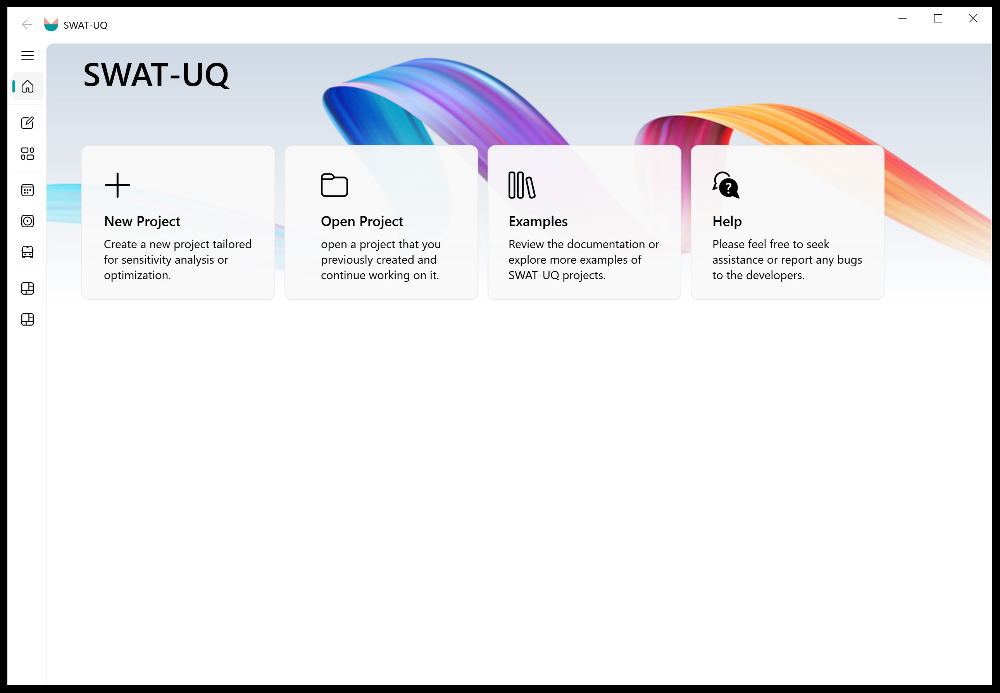

# SWAT-UQ ( Uncertainty Quantification for SWAT )

**SWAT-UQ**: This is a GUI Interface designed for parameter uncertainty quantification (UQ) of the **SWAT** model. The implementation of core functions is developed on [UQPyL](https://github.com/smasky/UQPyL), which is another useful python package. Therefore, you can use all Characteristics of UQPyL, like sensibility analysis, single-objective optimization, multi-objective optimization. The main advantages of this program is that users do not worry about code generation; **it fully automates the workflow from sensitivity analysis and parameter optimization to visualization.**

**Figure 1. SWAT-UQ Get Start Interface**

