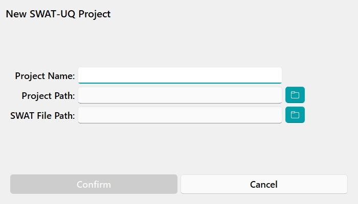
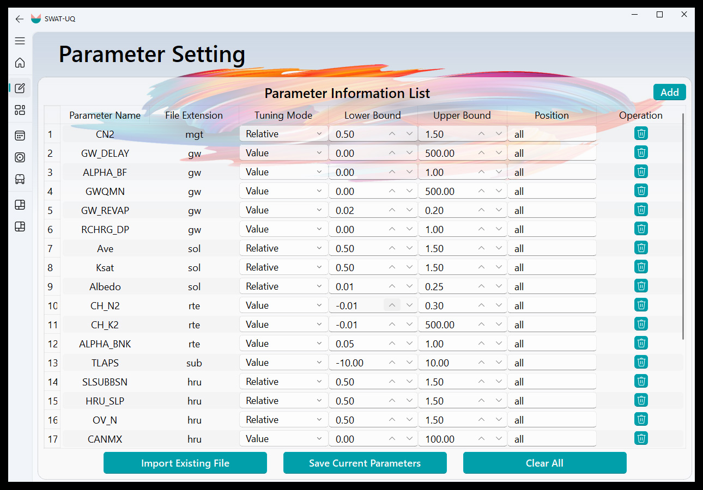
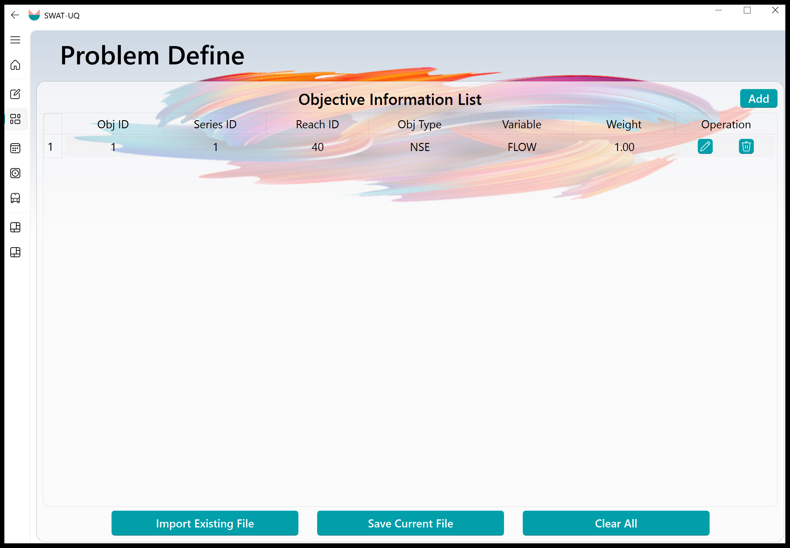

# SWAT-UQ ( Uncertainty Quantification for SWAT )

**SWAT-UQ:**  
This GUI interface is designed for parameter uncertainty quantification (UQ) of the **SWAT** model. Its core functionalities are built upon [UQPyL](https://github.com/smasky/UQPyL), our public released Python package for UQ. The prime purpose of designing SWAT-UQ is to provide full and easy access to combine UQPyL with SWAT, helping users to conduct sensitivity analysis, single-objective optimization, and multi-objective optimization. Therefore, a key advantage of this platform is that users do not need to worry about coding; **it seamlessly automates complete workflow from sensitivity analysis to parameter optimization, finally data visualization.**

 

<strong>Figure 1. SWAT-UQ at Get Start Interface</strong>

The SWAT-UQ framework consists of three modules corresponding to preparation, execution, and post-processing. 
As **Figure 1** shows, preparation involves **Parameter Setting**, **Objective Define**; Execution includes **Sensibility Analysis**, **Problem Optimization**, **Result Validation & Apply**; Post-processing provide templates for histogram (**Visualization A**) and line chart (**Visualization B**).

# Quick Start

Here, we provide a simple Quick Start guide. In future plans, we will provide detailed documentation and videos.  

Please choose the latest release version of SWAT-UQ.  

**Step1:** On the **Get Started** interface, click the **New Project** card to create a project or the **Open Project** card to open an existing one. You can also select the **Example** card for reference cases or the **Help** card for assistance.

 

<strong>Figure 2. New Project Card and Open Project Card</strong>

For the New Project Card (left picture of Figure 2), users need to provide the following information: the UQ Project name, the UQ Project path, and the SWAT Project path. After these inputs are provided, the program will verify the validity of the SWAT project files. If the verification is successful, other modules will be activated. Once the UQ Project is created, a project file named *.prj (where * represents the UQ Project name set by the user) will be saved in the specified UQ Project path.  

For the Open Project Card (right picture of Figure 2), users should select the folder that contains *.prj files. SWAT-UQ will then check the validity of the project file before proceeding.  

**Step2:** On the **Parameter Setting** and **Objective Definition**, the parameter file (.par) and the objective file (.obj) should be created. These files are crucial as they specify which parameters will be modified and what objectives will be evaluated by the program.

 
 

<strong>Figure 3. Parameter Setting Card and Figure 4. Objective Define Card</strong>

To be specific, as Figure 3 shows, on Parameter Setting Card, 

