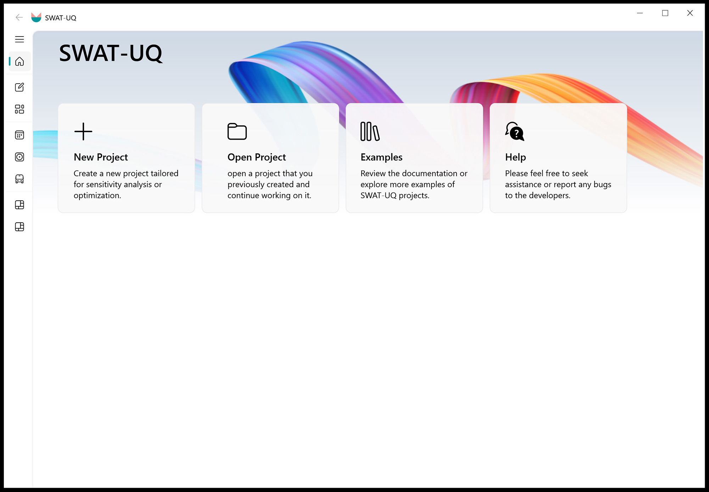

# SWAT-UQ ( Uncertainty Quantification for SWAT )

**SWAT-UQ:**  
This GUI interface is designed for parameter uncertainty quantification (UQ) of the **SWAT** model. Its core functionalities are built upon [UQPyL](https://github.com/smasky/UQPyL), our public released Python package for UQ. The prime purpose of designing SWAT-UQ is to provide full and easy access to combine UQPyL with SWAT, helping users to conduct sensitivity analysis, single-objective optimization, and multi-objective optimization. Therefore, a key advantage of this platform is that users do not need to worry about coding; **it seamlessly automates complete workflow from sensitivity analysis to parameter optimization, finally data visualization.**

 

<strong>Figure 1. SWAT-UQ at Get Start Interface</strong>

The SWAT-UQ framework consists of three modules corresponding to preparation, execution, and post-processing. 
As **Figure 1** shows, preparation involves **Parameter Setting**, **Objective Define**; Execution includes **Sensibility Analysis**, **Problem Optimization**, **Result Validation & Apply**; Post-processing provide templates for histogram (**Visualization A**) and line chart (**Visualization B**).

# Quick Start

Here, we provide a simple Quick Start guide. In future plans, we will provide detailed documentation and videos.  

Please choose the latest release version of SWAT-UQ.  

**Step1:** On the **Get Started** interface, click the **New Project** card to create a project or the **Open Project** card to open an existing one. You can also select the **Example** card for reference cases or the **Help** card for assistance.

 

<strong>Figure 2. New Project Card and Open Project Card</strong>

For the New Project Card (left picture of Figure 2), users need to provide the following information: the UQ Project name, the UQ Project path, and the SWAT Project path. After these inputs are provided, the program will verify the validity of the SWAT project files. If the verification is successful, other modules will be activated. Once the UQ Project is created, a project file named *.prj (where * represents the UQ Project name set by the user) will be saved in the specified UQ Project path.  

For the Open Project Card (right picture of Figure 2), users should select the folder that contains *.prj files. SWAT-UQ will then check the validity of the project file before proceeding.  

**Step2:** On the **Parameter Setting** and **Objective Definition**, the parameter file (.par) and the objective file (.obj) should be created. These files are crucial as they specify which parameters will be modified and what objectives will be evaluated by the program.

 
 

<strong>Figure 3. Parameter Setting Card and Figure 4. Objective Define Card</strong>

To be specific, as shown in Figure 3, the Parameter Setting Card enables users to define the parameters they wish to tune. There are two ways to add parameters to the information table: either by importing them from an existing file or by clicking the Add button to open the **Parameter Selection** widget. In this table, all selectable parameters are organized by the suffix of the SWAT project files. Additionally, the search bar provides a convenient way to locate specific parameters quickly.

 

<strong>Figure 4. Parameter Setting Table </strong>

After adding parameters, users can set the tuning mode, lower and upper bounds, and specify tuning files (default: all) for each parameter (**Figure 3 shows**). Finally, these settings should be saved to the UQ project folder by clicking "Saving Current Parameter" button.

There are also two ways to define the objective function: by importing from existing files or by user definition. For user definition, you should click "Add" button. 

 

<strong>Figure 5. Objective Define Table </strong>

As shown in Figure 5, users need to accurately fill in the objective ID, series ID, objective type, variable type, weight, and other relevant information. It is important to note that both the series ID and objective ID can be repeated, allowing for combinations of multiple series or weighted combinations of series. For more details, please refer to the comprehensive documentation.

After defining objectives, you can save them to the objective file. It is also allowed to define multiple objective functions within a single file.

**Step3:** Perform sensitivity analysis or parameter optimization as needed. 

Using Sensitivity Analysis as an example, as shown in the left image of Figure 6, users should first select the parameter file and objective file. Next, they choose the desired sensitivity analysis method and sampling technique. Users can then configure additional settings as required, fine-tuning the hyper-parameters to best meet project needs before proceeding. **SWAT-UQ thoughtfully displays the number of parameters and the total sample size to assist users in making informed decisions.**

Once all initial settings are all ready, click the "Next" button to proceed to the simulation and analysis process. The right image of Figure 6 displays the settings of simulation, including the selection of SWAT executable file, parallel numbers and problem name. Finally, click the "Initialize," "Sampling," and "Simulation" buttons in sequence, and wait for simulation completing. **SWAT-UQ can display the simulation progress in real-time, and users can also pause it to reconfigure settings. It would save the analysis result into UQ project folder (./Result/data/). The result file would be used to check or draw visualization picture.**

 

<strong> Figure 6. Sensibility Analysis Interface </strong>

For parameter optimization, users should still select parameter file and objective file at first. When users check more than two objectives, the multi-objective optimization would be activated; conversely, if only one objective is selected, single-objective optimization is used. After fine-tuning hyper-parameters, the optimization process would be started, like sensibility analysis. **SWAT-UQ can display the optimization progress in real-time, along with the optimal parameter values for each iteration.**

 

<strong> Figure 7. Parameter Optimization Interface </strong>

Here, we list the available sensibility analysis method and optimization method.

**Sensibility Analysis:**
- Sobol'
- Delta Test (DT) #TODO
- Extended Fourier Amplitude Sensitivity Test (eFAST)
- Random Balance Designs - Fourier Amplitude Sensitivity Test (RBD-FAST)
- Multivariate Adaptive Regression Splines-Sensitivity Analysis (MARS-SA) #TODO
- Morris
- Regional Sensitivity Analysis (RSA)

**Optimization Algorithm:**
(* indicates solving computational expensive optimization problem)
- **Single Objective Optimization**: SCE-UA, ML-SCE-UA, GA, CSA, PSO, DE, ABC, ASMO* (#TODO), EGO* (#TODO)  
- **Multi-Objective Optimization**: MOEA/D, NSGA-II, RVEA, MOASMO* (#TODO)

For Result Validation & Apply interface, SWAT-UQ allows users to simulate a specific set of parameters individually and extract the desired time series data, or apply the optimal parameters directly to the SWAT project files. This parameter set can be user-defined or sourced from completed optimization result files.

<strong> Figure 8. Result Validation Interface </strong>
