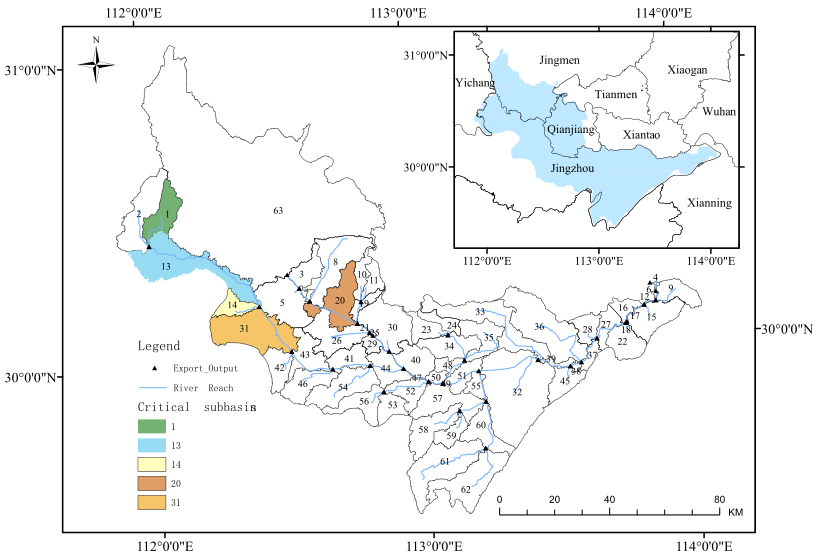

# Example 2: Best Management Practices for the Four Lake watershed

---

## Background

When watersheds are impacted by nonpoint source pollution, the integration of the SWAT model with best management practices (BMPs) has proven to be a reliable and effective tool. This example come from the [article](https://www.sciencedirect.com/science/article/pii/S0043135424016877)(Long et al, 2025). 

<figure align="center">
  
  <figcaption>Information about Four Lake watershed</figcaption>
</figure>

The Four Lake watershed is located in the middle reaches of the Yangtze River and the hinterland of the Jianghan Plain. For studying the water quality of this watershed, we build the SWAT model first. The data set used includes:

- **DEM** - The ASTER GDEM with a spatial resolution of 30 meters
- **Land Use** - The CNLUCC (China Land-Use/Cover Change) dataset 
- **Soil Data** - The Second National Land Survey of Nanjing Soil Institute 1:1 million Soil Counts
- **Meteorological Data** - Regional Surface Meteorological Factor-Driven Dataset for China
- **Runoff Observation** - Runoff of Hydrographic Yearbook. (2008.1.1 to 2021.12.31)
- **Water Quality Observation** - China National Environmental Monitoring Center (2020.11 to 2021.12)

The calibration of runoff and water quality is omitted here, with a primary focus on the process of Best Management Practices (BMPs). In China, Total Nitrogen (TN) and Total Phosphorus (TP) concentrations are critical indicators for assessing lake water quality. The distributions of TN and TP in 2021.12.31 are show blew:

<p align="center"> </p>
<p align="center"><strong>The distributions of TN and TP in the Four Lake basin</strong></p>

In the SWAT model used here, the lake is located within the sub-basin 51. Therefore, attention should be focused on the sub-basins 1–50, and management practices should be applied to the critical source areas, i.e., sub-basins  1, 13, 14, 20, and 31.

## Optimization

In SWAT, there are many built-in BMPs, e.g., the terracing operation (BMP1), the tile drainage (BMP2) ... the filter strip (BMP4) ... the grassed waterways (BMP7). 

For reduce TN and TP, the BMP4 and BMP7 are commonly selected. Considering the cost, this example only focuses on the critical sub-basins like 1, 13, 14, 20, and 31.

The **.ops** files in SWAT project control and set BMPs to simulated the watershed. The parameters involving the filter strip are:

- **FILTER_I:** Indicator for filter strip simulation (1 for active, 0 for inactive).
- **FILTER_RATIO:** The ratio of field area to filter strip area (ha/ha). Range: 0–300.
- **FILTER_CON:** Fraction of the HRU area where 10% is densely vegetated and evenly distributed along the filter strip. This 10% area can intercept 25–75% of surface runoff.
- **FILTER_CH:** Fraction of the 10% dense area occupied by fully channelized flow (dimensionless). Fully channelized flow is not filtered by the strip.

The parameters about grassed waterways are:

- **GWATI:** Indicator for vegetative channel simulation (1 for active, 0 for inactive).
- **GWATN:** Manning's roughness coefficient for overland flow within the vegetative channel.
- **GWATSPCON:** Linear parameter for calculating sediment transport capacity in the vegetative channel.
- **GWATD:** Depth of the vegetative channel (m). If not specified, it is set to 3/64 of GWATW.
- **GWATW:** Average width of the vegetative channel (m).
- **GWATL:** Length of the vegetative channel (km).
- **GWATS:** Average slope of the vegetative channel (m/m).

To simplify the application of BMPs, this example only optimize five parameters, i.e., **FILTER_I**, **FILTER_RATIO**, **GWATI**, **GWATW**, and **GWATL** — across sub-basins 1, 13, 14, 20, and 31. In addition, each sub-basin would be assigned a distinct set of parameter values, resulting in a total of 25 variables. The optimization objectives are to maximize the reduction of TN and TP loads, as well as the costs associated with these BMPs. Overall, this example is a **multi-objective** optimization problem involving **a mixture of parameters**.

The information (variable types and ranges) of optimized parameters can be concluded as follows:

| Name | Type | Range|
|------|------|------|
| FILTER_I | int | 0-1 |
| FILTER_RATIO | float | 0-300|
| GWATI | int | 0-1 |
| GWATW | discrete | 1, 5, 10, 15, 20, 25, 30 |
| GWATL | float | 10-1000|

Initially, it is necessary to edit the parameter files. In contrast to Example 1, the BMP parameters differ among sub-basins. Consequently, each sub-basin requires an independent definition of all relevant parameters. In SWAT-UQ, the discrete parameter GWATW represents all possible values in the 'Min_Max' field by linking them with an underscore ('_'):

```
GWATW v d 1_5_10_15_20_25_30 1
```

The complete content of the parameter file can be:

```
Name Mode Type Min_Max Scope
FILTER_I v i 0_1 1
FILTER_RATIO v f 0_300 1
GWATI v i 0_1 1
GWATW v d 1_5_10_15_20_25_30 1
GWATL v f 10_1000 1
FILTER_I v i 0_1 13
FILTER_RATIO v f 0_300 13
GWATI v i 0_1 13
GWATW v d 1_5_10_15_20_25_30 13
GWATL v f 10_1000 13
FILTER_I v i 0_1 14
FILTER_RATIO v f 0_300 14
GWATI v i 0_1 14
GWATW v d 1_5_10_15_20_25_30 14
GWATL v f 10_1000 14
FILTER_I v i 0_1 20
FILTER_RATIO v f 0_300 20
GWATI v i 0_1 20
GWATW v d 1_5_10_15_20_25_30 20
GWATL v f 10_1000 20
FILTER_I v i 0_1 31
FILTER_RATIO v f 0_300 31
GWATI v i 0_1 31
GWATW v d 1_5_10_15_20_25_30 31
GWATL v f 10_1000 31
```

💡 **Noted:** This file supports parameters with the same name, as they are distinguished by their indices.

Then, the objectives of this example are introduced. The first objective is the reduction of TN:

 $Obj_1 = \left ( TN_{base} - TN_{now}\right ) / TN_{base}$

where $TN_{base}$ and $TN_{now}$ denote the total amount of TN flowing out of the 51 sub-basin before and after the application of BMPs, respectively.

The second objective is the reduction of TP:

 $Obj_2 = \left ( TP_{base} - TP_{now}\right ) / TP_{base}$

where $TP_{base}$ and $TP_{now}$ denote the total amount of TP flowing out of the 51 sub-basin before and after the implementation of BMPs, respectively.

The third objective is the cost of BMPs. **The unit cost of filter strip is 420 Yuan/ha, while the grassed waterways is 600 Yuan/m^2.** Therefore, for a sub-basin, the cost is:

$cost_{filter}^i = Area_{AGRI}^i*FILTER_RATIO*FILTER_I*420$

$cost_{gwat}^i = GWATW*GWATL*GWATI*600$

$Obj_3 = \sum{cost_{filter}^i + cost_{gwat}^i}, i\in \left \{ 1,13,14,20,31 \right \}$

where $Area_{AGRI}$ represents the area of agricultural land use.

In this example, the computation of these objectives cannot be completed solely through the `*.eval` file control. Instead, the required data are obtained via file control, and the objective function (`objFunc`) should be defined manually by the user.

For the first two objectives, we require the total amount of TN and TP flowing out of the 51 sub-basin in 2021.

Therefore, the `*.eval` file can be edited as follows:

```
SER_1 : ID of series data
OBJ_1 : ID of objective function
WGT_1.0 : Weight of series combination
RCH_51 : ID of RCH, or SUB, or HRU
COL_42 : Extract Variable. The 'NUM' is differences with *.rch, *.sub, *.hru.
FUNC_7 : Func Type ( 1 - NSE, 2 - RMSE, 3 - PCC, 4 - Pbias, 5 - KGE, 6 - Mean, 7 - Sum, 8 - Max, 9 - Min )
2021.1.1 to 2021.12.31

SER_2 : ID of series data
OBJ_2 : ID of objective function
WGT_1.0 : Weight of series combination
RCH_51 : ID of RCH, or SUB, or HRU
COL_43 : Extract Variable. The 'NUM' is differences with *.rch, *.sub, *.hru.
FUNC_7 : Func Type ( 1 - NSE, 2 - RMSE, 3 - PCC, 4 - Pbias, 5 - KGE, 6 - Mean, 7 - Sum, 8 - Max, 9 - Min )
2021.1.1 to 2021.12.31
```

Then, we define the `userObjFunc`. The `userObjFunc` would accept a python dict named `attr` that contain several keywords, e.g., `x`, `objs`, `cons`, `objSeries`, `conSeries`, `HRUInfos`. 

API:
```
attr - a python dict

keywords:

- x : The input decision, np.1darray
- objs : The objective values of this input decision, a python dict, use `objs[objID]` defined by the *.evl file
- cons : Similar to objs
- objSeries : A python dict records the series defined by the *.evl file, use `objSeries[objID][serID]`
- conSeries : Similar to objSeries
- HRUInfos : A pandas table that records the information about HRU, columns are ["HRU_ID", "SUB_ID", "HRU_Local_ID", "Slope_Low", "Slope_High", "Luse", "Area"]
```

Therefore, we can define the `userObjFunc`:

```python
# Define base total nitrogen (TN) and total phosphorus (TP) loads for normalization
TN_Base = 1.558e7  # Baseline total nitrogen load (unit depends on context)
TP_Base = 1.154e6  # Baseline total phosphorus load

# Define the list of Basin IDs where BMPs (Best Management Practices) are applied
Basins = [1, 13, 14, 20, 31]

def userObjFunc(attr):
    """
    User-defined objective function.

    Parameters:
    - attr: dict
        Contains input decision variables, objective values, constraint values,
        time series for objectives and constraints, and HRU (Hydrological Response Unit) information.

    Returns:
    - objs: np.ndarray
        Array containing computed objective values [obj_1, obj_2, obj_3].
    """

    objs = np.zeros(3)  # Initialize three objective values

    # Extract decision variables (not used directly here, kept for potential future needs)
    x = attr["x"]

    # Compute the first objective:
    # Relative reduction in TN load compared to baseline
    objs[0] = (TN_Base - attr['objs'][1]) / TN_Base

    # Compute the second objective:
    # Relative reduction in TP load compared to baseline
    objs[1] = (TP_Base - attr['objs'][2]) / TP_Base

    # Compute the third objective: Total cost of BMP implementations
    HRUInfosTable = attr["HRUInfos"]  # Extract HRU information table

    cost = 0  # Initialize total cost

    for i, ID in enumerate(Basins):
        # Calculate the total area of agricultural land (AGRL) in the subbasin
        areas = np.sum(
            HRUInfosTable.loc[
                (HRUInfosTable.SUB_ID == ID) & (HRUInfosTable.Luse == "AGRL"),
                "Area"
            ].tolist()
        )

        # Extract BMP design parameters from decision variables
        filter_I = x[5 * i]       # Filter switch
        filter_ratio = x[5 * i + 1]  # Fraction of area treated by filter
        graw_I = x[5 * i + 2]     # Graw BMP switch
        graw_W = x[5 * i + 3]     # Graw BMP width
        graw_L = x[5 * i + 4]     # Graw BMP length

        # Calculate the cost of filter BMPs
        cost_filter = areas * filter_ratio * filter_I * 420  # unit cost= 420

        # Calculate the cost of Graw BMPs
        cost_graw = graw_W * graw_L * graw_I * 600  # unit cost = 600

        # Accumulate total cost
        cost += cost_filter + cost_graw

    objs[2] = cost  # Assign total cost to the third objective

    return objs
```

All preparatory work has been completed, and the optimization process can now be conducted.

```python
import numpy as np
from swatuq import SWAT_UQ
from UQPyL.optimization.multi_objective import NSGAII

nInput = 25
nOutput = 3

projectPath = "E:\\BMPs\\TxtInOut"
exeName = "swat.exe"
workPath = "E:\\DJ_FSB"
paraFileName = "para_bmp.par"
evalFileName = "obj_bmp.evl"
specialFileName = "special_paras1.txt"

problem = SWAT_UQ(projectPath = projectPath, swatExeName = exeName, 
                  specialFileName = specialFileName, workPath = workPath, 
                  paraFileName = paraFileName, evalFileName = evalFileName, 
                  verboseFlag = True, numParallel = 10,
                  userObjFunc = userObjFunc, nOutput = 3, 
                  optType = ["max", "max", "min"])

nsgaii = NSGAII(nPop = 50, maxFEs = 20000, saveFlag = True, verboseFlag = True, verboseFreq = 5)

nsgaii.run(problem = problem)

```


