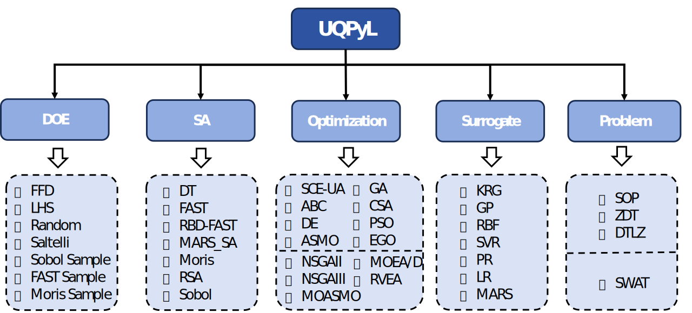
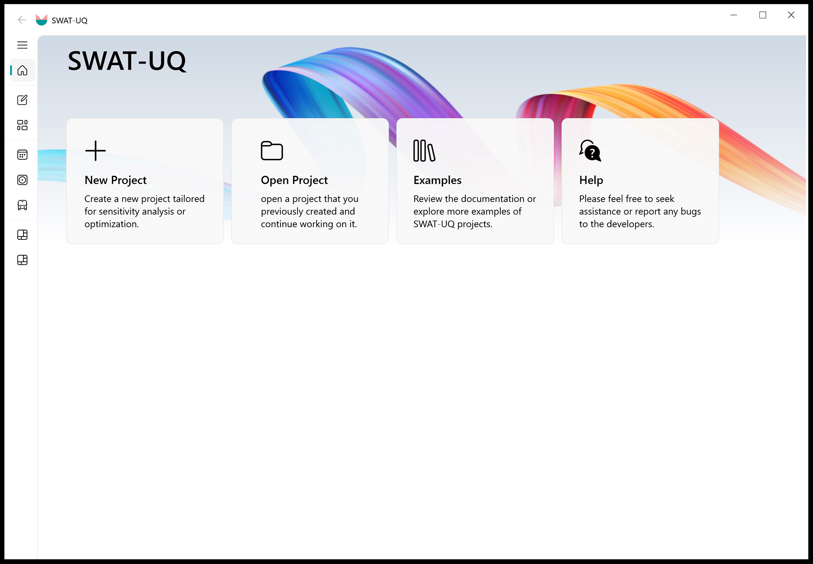

# Welcome to SWAT-UQ documentation

     

**SWAT-UQ** is an extend project of [UQPyL](https://github.com/smasky/UQPyL) - a comprehensive platform for uncertainty analysis and parameter optimization. This project aims to provide full integration of UQPyL and **Soil and Water Assessment Tool** (SWAT), enabling users to easily perform sensitivity analysis, single-objective optimization, and multi-objective optimization and so on. 

There are two available versions of SWAT-UQ, tailored to meet different user needs:

 - **SWAT-UQ-DEV (Develop Version)** - Designed for advanced users who require high flexibility and customization in building and managing their modeling workflows.

 - **SWAT-UQ-GUI (GUI Version)** - Offers an intuitive graphical interface for streamlined operation, ideal for users seeking minimal coding involvement.

With SWAT-UQ, users can seamlessly incorporate powerful uncertainty quantification and optimization capabilities into their SWAT-based hydrological modeling projects.

---

## 🔗 Project Overview

- **Website**: [Official Site](http://www.uq-pyl.com) (**TODO**: Needs update)
- **Source Code**: [GitHub Repository](https://github.com/smasky/SWAT-UQ/)
- **Documentation**: [ReadTheDocs](https://swat-uq.readthedocs.io/en/latest/)
- **Citation Infos**: SWAT-UQ (Future Plan)

## 🚀 Getting Started

   -  Tutorial
      - [SWAT-UQ-DEV](swat_uq_dev.md)
      - [SWAT-UQ-GUI](swat_uq_gui.md)
   - Example Collection
      - [Example 1: Runoff Calibration](example_runoff_calibration.md)
      - [Example 2: Best Management Practices](best_management_practices.md)

---

## ⭐ UQ Project Series

- [UQPyL](https://github.com/smasky/UQPyL), a Python package for **Uncertainty Quantification** and **Parameter Optimization**.

<figure align="center">
  
  <figcaption>Overview of UQPyL</figcaption>
</figure>

- [SWAT-UQ](https://github.com/smasky/SWAT-UQ), providing script-based (Develop) and GUI versions to integrate UQPyL and the Soil and Water Assessment Tool (**SWAT**) model. 

<figure align="center">
  
  <figcaption>SWAT-UQ GUI Version</figcaption>
</figure>

---
