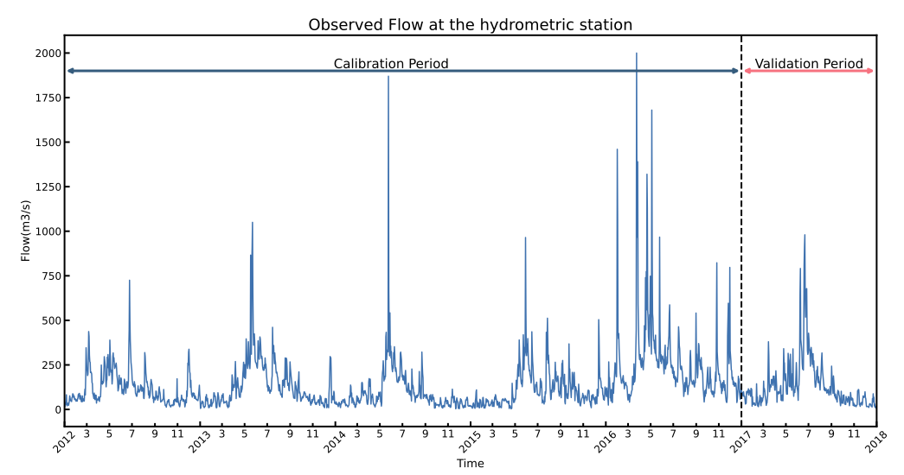

# Example 1: Runoff Calibration

---

## Background

The Dongjiang watershed in Guangdong is a critical freshwater source, covering an area of over 35,000 square kilometers. It supplies water to several major cities, including Guangzhou, Shenzhen, and Hong Kong.

In this study, we use the Fengshuba and XinFengJiang sub-basins of the Dongjiang watershed as examples for runoff calibration.

We primarily present the calibration process for the Fengshuba sub-basin, which has a catchment area of 5,150 km² and an average annual rainfall of 1,581 mm. But, for helping users familiar with SWAT-UQ, the calibration of the XinFengJiang sub-basin is provided as an additional exercise.

<figure align="center">
  
</figure>

## SWAT Modelling

For building SWAT model of Fengshuba sub-basin, the data set used includes:

- **DEM** - The ASTER GDEM with a spatial resolution of 30 meters
- **Land Use** - The RESDC (Resource and Environmental Science Data Center) dataset
- **Soil Data** - The HWSD (Harmonized World Soil Database)
- **Meteorological Data** - The CMADS (China Meteorological Assimilation Driving Dataset)

- **Observation** - Runoff of Hydrographic Yearbook. (2008.1.1 to 2017.12.31)

For calibration, the simulation periods are:

- **Warm up Period** - 2008.1.1 to 2011.12.31
- **Calibration Period** - 2012.1.1 to 2016.12.31
- **Validation Period** - 2017.1.1 to 2017.12.31

<figure align="center">
  
</figure>

💡 **Noted:** [Click this link to download project files.](https://github.com/smasky/SWAT-UQ/raw/main/example/example1/project_FSB.zip)

## Problem Define

The definition of the problem refers to the process of transforming a practical problem into an abstract problem that can be described using mathematical formulas and code. 

In this example, the ultimate goal is to obtain the SWAT model whose output completely approximate to observed data. First, we need to identify the indicators to evaluate how well the SWAT model has been built. In hydrology, common indicators, e.g., NSE, R2, KGE, RMSE, PCC, and so on. Here, we use the NSE. 

Therefore, this practical problem can be abstracted into:
<figure align="center">
  
</figure>
Where $x$ denotes the undetermined parameters of the SWAT model; $NSE(\cdot)$ denotes the NSE operation; $sim$ denotes the simulation data obtained from running the SWAT model; $ob$ denotes the observed data from Chinese year book; $lb$, $ub$ denotes the lower and upper bound of each parameters.

Next, based on this abstracted problem, we can describe it using code within the framework of SWAT-UQ.

## Sensitivity Analysis

First, we would conduct sensitivity analysis (SA) for SWAT model. Refer to SWAT Manual and the [article](https://www.sciencedirect.com/science/article/pii/S0022169417305851)(Liu et al, 2017), following parameters are selected for SA.

| ID | Abbreviation| Where | Assign Type | Range |
|----|-------|-------|-------------|-------|
| P1 |CN2|MGT| Relative | [-0.4, 0.2] |
| P2 | GW_DELAY| GW | Value | [30, 450] |
| P3 | ALPHA_BF | GW | Value | [0.0, 1.0] |
| P4 | GWQMN | GW | Value | [0.0, 500.0] |
| P5 | GW_REVAP | GW | Value | [0.02, 0.20] |
| P6 | RCHRG_DP | GW | Value | [0.0, 1.0] |
| P7 | SOL_AWC | SOL | Relative | [0.5, 1.5] |
| P8 | SOL_K | SOL | Relative | [0.5, 15.0] |
| P9 | SOL_ALB | SOL | Relative | [0.01, 5.00] |
| P10 | CH_N2 | RTE | Value | [-0.01, 0.30] |
| P11 | CH_K2 | RTE | Value | [-0.01, 500.0] |
| P12 | ALPHA_BNK | RTE | Value | [0.05, 1.00] |
| P13 | TLAPS | SUB | Value | [-10.0, 10.0] |
| P14 | SLSUBSSN | HRU | Relative | [0.05, 25.0] |
| P15 | HRU_SLP | HRU | Relative | [0.50, 1.50] |
| P16 | OV_N | HRU | Relative | [0.10, 15.00] |
| P17 | CANMX | HRU | Value | [0.0, 100.0] |
| P18 | ESCO | HRU | Value | [0.01, 1.00] |
| P19 | EPCO | HRU | Value | [0.01, 1.00] |
| P20 | SFTMP | BSN | Value | [-5.0, 5.0] |
| P21 | SMTMP | BSN | Value | [-5.0, 5.0] |
| P22 | SMFMX | BSN | Value | [0.0, 20.0] |
| P23 | SMFMN | BSN | Value | [0.0, 20.0] |
| P24 | TIMP | BSN | Value | [0.01, 1.00] |

As the [tutorial](./swat_uq_dev.md#quick-start) introduce, we first prepare the **parameter file**:

File name: `paras_sa.par`

```
Name Mode Type Min_Max Scope
CN2 r f -0.4_0.2 all
GW_DELAY v f 30_450 all
ALPHA_BF v f 0.0_1.0 all
GWQMN v f 0.0_500.0 all
GW_REVAP v f 0.02_0.20 all
RCHRG_DP v f 0.0_1.0 all
SOL_AWC r f 0.5_1.5 all
SOL_K r f 0.5_15.0 all
SOL_ALB r f 0.01_5.00 all
CH_N2 v f -0.01_0.30 all
CH_K2 v f  -0.01_500.0 all
ALPHA_BNK v f 0.05_1.00 all
TLAPS v f -10.0_10.0 all
SLSUBSSN r f 0.05_25.0 all
HRU_SLP r f 0.50_1.50 all
OV_N r f 0.10_15.00 all
CANMX v f 0.0_100.0 all
ESCO v f 0.01_1.00 all
EPCO v f 0.01_1.00 all
SFTMP v f -5.0_5.0 all
SMTMP v f -5.0_5.0 all
SMFMX v f 0.0_20.0 all
SMFMN v f 0.0_20.0 all
TIMP v f 0.01_1.00 all
```

Then, the **evaluation file** should be created:

File name: `obj_sa.evl`

```
SER_1 : ID of series data
OBJ_1 : ID of objective function
WGT_1.0 : Weight of series combination
RCH_23 : ID of RCH, or SUB, or HRU
COL_2 : Extract Variable. The 'NUM' is differences with *.rch, *.sub, *.hru.
FUNC_1 : Func Type ( 1 - NSE, 2 - RMSE, 3 - PCC, 4 - Pbias, 5 - KGE, 6 - Mean, 7 - Sum, 8 - Max, 9 - Min )

1	2012 1 1	38.6
2	2012 1 2	16.2
3	2012 1 3	24.5
4	2012 1 4	26.9
5	2012 1 5	56.2
6	2012 1 6	82.1
7	2012 1 7	32.8
8	2012 1 8	20.5
9	2012 1 9	32.3
10	2012 1 10	28.9
11	2012 1 11	36.5
...
...
...
1821	2016 12 25	94.8
1822	2016 12 26	106
1823	2016 12 27	135
1824	2016 12 28	87.4
1825	2016 12 29	81.5
1826	2016 12 30	94.9
1827	2016 12 31	89.9
```

💡 **Noted:** [Click this link to download related files](https://github.com/smasky/SWAT-UQ/raw/main/example/example1/sa.zip)(`para_sa.par` and `obj_sa.evl`)

Based on this evaluation file, SWAT-UQ would extract the data of Reach 23 from `output.rch` during 2012.1.1 to 2016.12.31. In addition, the NSE function is used to evaluate the performance of model outputs.

Finally, we can conduct the sensitivity analysis within python script-based environment:

```python
from swat_uq import SWAT_UQ

projectPath = "E://swatProjectPath" # Use your SWAT project path
workPath = "E://workPath" # Use your work path
exeName = "swat2012.exe" # The exe name you want execute

#Blew two files should be created in the workPath
paraFileName = "paras_sa.par" # the parameter file you prepared
evalFileName = "obj_sa.evl" # the evaluation file you prepared

problem = SWAT_UQ(
   projectPath = projectPath, # set projectPath
   workPath = workPath, # set workPath
   swatExeName = exeName # set swatExeName
   paraFileName = paraFileName, # set paraFileName
   evalFileName = evalFileName, # set evalFileName
   verboseFlag = True, # enable verboseFlag to check if setup is configured properly.
   numParallel = 10 # set the parallel numbers of SWAT
)

# The SWAT-related Problem is completed. 

# Perform sensitivity analysis
from UQPyL.sensibility import FAST

fast = FAST()

# Generate sample set
X = fast.sample(problem = problem, N = 512)
# Therefore, the shape of X would be (12288, 24). It would be time-consuming to evaluate.

# Recommend: a. use Linux Serve Computer; b. use surrogate-based methods.

Y = problem.objFunc(X)

res = fast.analyze(X, Y)

print(res)
```

The analysis results of FAST methods are shown below:

<figure align="center">
  
</figure>

We select the top 10 parameters to be calibrated, i.e., CN2, ALPHA_BNK, SOL_K, SLSUBBSN, ESCO, HRU_SLP, OV_N, TLAPS, SOL_ALB, CH_K2.

## Optimization

Based on the above sensitivity analysis, we need to recreate parameter file:

File name: `para_op.par`

```
Name Mode Type Min_Max Scope
CN2 r f -0.4_0.2 all
SOL_K r f 0.5_15.0 all
SOL_ALB r f 0.01_5.00 all
CH_K2 v f  -0.01_500.0 all
ALPHA_BNK v f 0.05_1.00 all
TLAPS v f -10.0_10.0 all
SLSUBSSN r f 0.05_25.0 all
HRU_SLP r f 0.50_1.50 all
OV_N r f 0.10_15.00 all
ESCO v f 0.01_1.00 all
```

The **evaluation file** is the same as the SA. But it is a good habit to rename it to `obj_op.evl`

💡 **Noted:** [Click this link to download related files](https://github.com/smasky/SWAT-UQ/raw/main/example/example1/op.zip)(`para_op.par`, `obj_op.evl` and `val_op.evl` for validation).

Finally, we can run the optimization within python script-based environment:

```python
from swat_uq import SWAT_UQ

projectPath = "E://swatProjectPath" # Use your SWAT project path
workPath = "E://workPath" # Use your work path
exeName = "swat2012.exe" # The exe name you want execute

#Blew two files should be created in the workPath
paraFileName = "paras_sa.par" # the parameter file you prepared
evalFileName = "obj_sa.evl" # the evaluation file you prepared

problem = SWAT_UQ(
   projectPath = projectPath, # set projectPath
   workPath = workPath, # set workPath
   swatExeName = exeName # set swatExeName
   paraFileName = paraFileName, # set paraFileName
   evalFileName = evalFileName, # set evalFileName
   verboseFlag = True, # enable verboseFlag to check if setup is configured properly.
   numParallel = 10 # set the parallel numbers of SWAT
)

# The SWAT-related Problem is completed. 

from UQPyL.optimization import PSO

pso = PSO(nPop = 50, maxFEs = 30000, verboseFlag = True, saveFlag = True)

pso.run(problem = problem)

```

The optimization results show:

<figure align="center">
  
</figure>

We list the optimal decision with NSE->0.88:

| CN2 | SOL_K | SOL_ALB | CH_K2 | ALPHA_BNK | TLAPS | SLSUBSSN | HRU_SLP | OV_N | ESCO |
|-----|-------|---------|-------|-----------|-------|----------|---------|------|------|
|-0.236 | 14.278 | 0.325 | 46.604 | 1.000 | -5.532 | 1.611 | 0.515 | 3.162 | 0.010 |

## Validation

We have obtained the optimal parameter settings for the SWAT model.
Now, we proceed to perform validation.

The evaluation file must first be prepared.
Here, we apply the observed data ranging from 2017.1.1 to 2017.12.31.

File name: `val_op.evl`

```
SER_1 : ID of series data
OBJ_1 : ID of objective function
WGT_1.0 : Weight of series combination
RCH_23 : ID of RCH, or SUB, or HRU
COL_2 : Extract Variable. The 'NUM' is differences with *.rch, *.sub, *.hru.
FUNC_1 : Func Type ( 1 - NSE, 2 - RMSE, 3 - PCC, 4 - Pbias, 5 - KGE, 6 - Mean, 7 - Sum, 8 - Max, 9 - Min )

1 2017 1 1 74.4
2 2017 1 2 99.4
3 2017 1 3 77.4
...
...
365 2017 12 31 19.1
```

Using a Python script-based environment, we conduct the validation as follows:

```python

# optima
X = np.array([-0.236, 14.278, 0.325, 46.604, 1.000, -5.532, 1.611, 0.515, 3.162, 0.010])

# Perform validation
# `problem.validate_parameters` expects the optimized parameters and the validation file.
# It returns a dictionary containing two keys: 'objs' (objective values) and 'cons' (constraint violations).
res = problem.validate_parameters(X, valFile = "val_op.evl") 

# Print the objective function values from the validation results
print(res["objs"])
```

## Postprocessing

Except for sensitivity analysis and optimization, SWAT-UQ support to extract data from output files.

```
The `series.evl` should be prepared:
SER_1 : ID of series data
OBJ_1 : ID of objective function
WGT_1 : Weight of series combination
RCH_23  : ID of subbasin to be included in the objective function
COL_2 : Column ID of variables in output.rch
FUNC_10     : Type of objective function (e.g., 1: NSE, 2: RMSE. 3:PCC, 4:Pbias, 5:KGE)
2012/1/1 to 2016/12/31 : Period for data extraction
```

We can extract the data:

```python
X = np.array([-0.236, 14.278, 0.325, 46.604, 1.000, -5.532, 1.611, 0.515, 3.162, 0.010])

# Extract the corresponding series data based on the parameter set X
attr = problem.extract_series(X, seriesFile="series.evl")

# The returned object 'attr' is a Python dictionary.
# Simulation and observation data are stored separately by function type ('objSeries' or conSeries)objective function ID (objID) and series ID (serID). 

simData = attr['objSeries'][1][1]['sim'] # Simulation data
obData = attr['objSeries'][1][1]['obs']  # Observation data

```

## Apply optima to project


Now, we need to apply these values to the project folder:

```python

# Optimal parameter values
X = np.array([-0.236, 14.278, 0.325, 46.604, 1.000, -5.532, 1.611, 0.515, 3.162, 0.010])

# Apply parameters
problem.apply_parameters(X, replace=False)  
# Setting 'replace=False' will apply the values to the working directory (workOriginPath) without modifying the original project files.

# Alternatively
problem.apply_parameters(X, replace=True)  
# Setting 'replace=True' will overwrite the original project folder, which is not recommended.

```

So far, the calibration work is completed.


## Exercise for users

We provide an exercise based on the Xinfengjiang sub-basin, which is part of the Dongjiang watershed.

You can download the complete project files here:
[Click here to download project files](https://github.com/smasky/SWAT-UQ/raw/main/example/example1/project_XFJ.zip)

Within the downloaded project files, the observed data is stored in the file named `observed.txt`.

If you have any questions or need assistance, feel free to contact us.