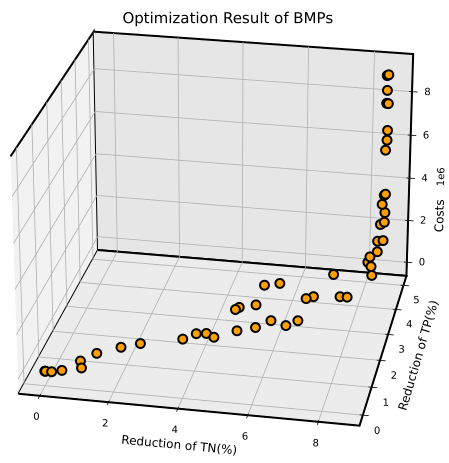

# 示例 2：四湖流域的最佳管理实践（BMP）优化

---

## 背景介绍

当流域受到非点源污染影响时，结合SWAT模型与最佳管理实践（Best Management Practices，BMPs）进行流域污染管理，已被证明是一种可靠且有效的方案。本示例参考了 [Long 等（2025）](https://www.sciencedirect.com/science/article/pii/S0043135424016877) 的研究成果。

<figure align="center">
  
</figure>

<p align="center"><strong>四湖流域概况</strong></p>

四湖流域位于长江中游、江汉平原腹地。为研究该流域水质输移过程，首先构建了关于四湖流域的SWAT模型。本例使用的数据包括：

- **DEM（数字高程模型）** - 使用 ASTER GDEM，分辨率为 30 米  
- **土地利用** - 使用中国土地利用/覆盖变化（CNLUCC）数据集  
- **土壤数据** - 来自南京土壤研究所的第二次全国土壤普查（1:100 万）  
- **气象数据** - 中国区域地面气象因子驱动数据集  
- **径流观测** - 水文年鉴数据（2008.1.1 至 2021.12.31）  
- **水质观测** - 中国环境监测总站数据（2020.11 至 2021.12）

本示例省略了径流和水质的校准部分，重点介绍 **最佳管理实践（BMP）** 的优化过程。在中国，**总氮（TN）**和**总磷（TP）**是评估湖泊水质的重要指标。以下是 2021 年 12 月 31 日 TN 和 TP 的分布图：

<p align="center"> </p>
<p align="center"><strong>四湖流域 TN 和 TP 的分布情况</strong></p>

在本研究的SWAT模型中，主湖区位于**子流域 32**；主要入湖流量来自**子流域 51**。此外，重点管理区域包括识别出的关键污染源子流域：**1、13、14、20、31**。

## 优化设置

SWAT 模型中内置了多种 BMP，例如梯田操作（BMP1）、瓦管排水（BMP2）、植被过滤带（BMP4）、植草水道（BMP7）等。

为了减少 TN 和 TP 的排放，植被过滤带（BMP4）和植草水道（BMP7）最为常用。考虑成本后，本示例仅在关键子流域（1、13、14、20、31）中应用 BMP。

SWAT 项目中的 **`.ops` 文件**用于控制 BMP 的设置，其中与植被过滤带有关的参数包括：

- `FILTER_I`：是否启用植被过滤带（1 启用，0 不启用）  
- `FILTER_RATIO`：农田面积与植被过滤带面积的比例（单位：ha/ha，范围：0–300）  
- `FILTER_CON`：植被过滤带中高密植区域占比（未启用）  
- `FILTER_CH`：通道化流量比例（未启用）

与植草水道有关的参数包括：

- `GWATI`：是否启用植草水道（1 启用，0 不启用）  
- `GWATN`、`GWATSPCON`：水力特性（略）  
- `GWATD`：沟渠深度（默认 3/64 * GWATW）  
- `GWATW`：植草水道宽度（单位：米）  
- `GWATL`：植草水道长度（单位：千米）  
- `GWATS`：坡度（单位：m/m）

为简化问题，假设每个子流域仅优化 5 个参数（FILTER_I、FILTER_RATIO、GWATI、GWATW、GWATL），因此共计 **25 个变量**。优化目标包括：**目标1：TN减少率、目标2：TP减少率、目标3：工程实施成本**，因此，此问题是一个典型的 **混合型多目标优化问题**。

本例优化参数信息如下：

| 名称 | 类型 | 范围 | 单位 |
|------|------|------|------|
| FILTER_I | 整数 | 0–1 | 无 |
| FILTER_RATIO | 浮点数 | 1–300 | 无 |
| GWATI | 整数 | 0–1 | 无 |
| GWATW | 离散 | 1, 5, 10, 15, 20, 25, 30 | 米 |
| GWATL | 浮点数 | 10–1000 | 千米 |

由于每个子流域的 BMP 设置不同，建立参数文件时，需要为每个子流域单独定义这 5 个参数。

注意，离散型参数 `GWATW`的所有可能值需通过下划线分隔列在 `Min_Max` 字段中：

```
GWATW v d 1_5_10_15_20_25_30 1
```

完整的参数文件命名为：`para_bmp.par`

```
Name Mode Type Min_Max Scope
FILTER_I v i 0_1 1
FILTER_RATIO v f 1_300 1
GWATI v i 0_1 1
GWATW v d 1_5_10_15_20_25_30 1
GWATL v f 10_1000 1
FILTER_I v i 0_1 13
FILTER_RATIO v f 1_300 13
GWATI v i 0_1 13
GWATW v d 1_5_10_15_20_25_30 13
GWATL v f 10_1000 13
FILTER_I v i 0_1 14
FILTER_RATIO v f 1_300 14
GWATI v i 0_1 14
GWATW v d 1_5_10_15_20_25_30 14
GWATL v f 10_1000 14
FILTER_I v i 0_1 20
FILTER_RATIO v f 1_300 20
GWATI v i 0_1 20
GWATW v d 1_5_10_15_20_25_30 20
GWATL v f 10_1000 20
FILTER_I v i 0_1 31
FILTER_RATIO v f 1_300 31
GWATI v i 0_1 31
GWATW v d 1_5_10_15_20_25_30 31
GWATL v f 10_1000 31
```

💡 **提示：** 文件支持重复名称参数，因为通过参数编号进行区分。

本例中包含三个优化目标：

1.**TN减排率：**
   $$
   Obj_1 = \frac{TN_{base} - TN_{now}}{TN_{base}}
   $$
   表示应用BMP前后，子流域51的TN流出量的相对减少量。

2.**TP减排率：**
   $$
   Obj_2 = \frac{TP_{base} - TP_{now}}{TP_{base}}
   $$
   表示应用BMP前后，子流域51的TP流出量的相对减少量。

3.**BMPs布置成本：**

  - 植被过滤带单价：420 元/ha  
  - 植草水道单价：200 元/ha 

  因此，子流域$i$的成本为：

  $$
  cost_{filter}^i = Area_{AGRI}^i \times FILTER\_RATIO \times FILTER\_I \times 420
  $$
     
  $$
  cost_{gwat}^i = GWATW \times GWATL / 10 \times GWATI \times 200
  $$

  总成本可表示为：

  $$
  Obj_3 = \sum_{i \in \{1,13,14,20,31\}} (cost_{filter}^i + cost_{gwat}^i)
  $$

在本例，目标函数的构建**无法仅通过`*.eval`文件完成**。但我们可以从该文件中获取所需的基础数据，之后通过用户自定义函数`objFunc`或`conFunc`实现目标或约束函数的具体逻辑。

因此，构建如下 `eval` 文件：

```txt
SER_1 : ID of series data
OBJ_1 : ID of objective function
WGT_1.0 : Weight of series combination
RCH_51 : ID of RCH, or SUB, or HRU
COL_42 : Extract Variable. The 'NUM' is differences with *.rch, *.sub, *.hru.
FUNC_7 : Func Type ( 1 - NSE, 2 - RMSE, 3 - PCC, 4 - Pbias, 5 - KGE, 6 - Mean, 7 - Sum, 8 - Max, 9 - Min )
2021/01/01 to 2021/12/31 : 

SER_2 : ID of series data
OBJ_2 : ID of objective function
WGT_1.0 : Weight of series combination
RCH_51 : ID of RCH, or SUB, or HRU
COL_43 : Extract Variable. The 'NUM' is differences with *.rch, *.sub, *.hru.
FUNC_7 : Func Type ( 1 - NSE, 2 - RMSE, 3 - PCC, 4 - Pbias, 5 - KGE, 6 - Mean, 7 - Sum, 8 - Max, 9 - Min )
2021/01/01 to 2021/12/31 : Period for data extraction
```

关于自定义 `userObjFunc`函数计算三个优化目标。该函数接受一个包含固定字段的Python字典 `attr`，并返回目标值。

`attr`的API说明如下：

```
attr -> 一个 Python 字典，包含以下内置关键字：

- x : 输入的决策变量，np.1darray 类型（一维数组）
- objs : 当前输入对应的目标函数值，Python 字典，通过 `attr['objs'][objID]` 访问（objID 来自 *.evl 文件）
- cons : 约束函数值，与 objs 相似
- objSeries : 存储 *.evl 中定义的目标函数序列数据，通过 `attr['objSeries'][objID][serID]` 访问
- conSeries : 与 objSeries 类似，用于约束函数数据
- HRUInfos : 一个 pandas 表格，记录 HRU（汇流单元）信息，列为：
  ["HRU_ID", "SUB_ID", "HRU_Local_ID", "Slope_Low", "Slope_High", "Luse", "Area"]
```

以下是定义`userObjFunc`函数具体Python环境编程：

```python
# 定义基准 TN / TP 值（用于归一化计算）
TN_Base = 3.314e7  # 总氮基准值（单位视情况而定）
TP_Base = 3.717e6  # 总磷基准值

# 定义应用 BMP（最佳管理措施）措施的子流域编号列表
Basins = [1, 13, 14, 20, 31]

def userObjFunc(attr):
    """
    用户自定义目标函数。

    参数：
    - attr: dict
        包含决策变量、目标值、约束值、时间序列、HRU 信息等。

    返回：
    - objs: np.ndarray
        包含 3 个目标函数值的数组 [obj_1, obj_2, obj_3]
    """
    
    objs = np.zeros(3)  # 初始化三个目标值
    x = attr["x"]       # 获取决策变量

    # 第一个目标函数：TN 相对减少率
    objs[0] = (TN_Base - attr['objs'][1]) / TN_Base

    # 第二个目标函数：TP 相对减少率
    objs[1] = (TP_Base - attr['objs'][2]) / TP_Base

    # 第三个目标函数：BMP 实施的总成本
    HRUInfosTable = attr["HRUInfos"]
    cost = 0

    for i, ID in enumerate(Basins):
        # 计算当前子流域的总面积
        areas = np.sum(
            HRUInfosTable.loc[
                (HRUInfosTable.SUB_ID == ID),
                "Area"
            ].tolist()
        )

        # 从决策变量中提取 BMP 设计参数
        filter_I = x[5 * i]          # 滤带开关
        filter_ratio = x[5 * i + 1]  # 滤带处理比例
        graw_I = x[5 * i + 2]        # Graw BMP 开关
        graw_W = x[5 * i + 3]        # Graw BMP 宽度
        graw_L = x[5 * i + 4]        # Graw BMP 长度

        # 滤带措施成本计算（单位成本：420 元/公顷）
        cost_filter = areas * filter_ratio * filter_I * 420

        # Graw 措施成本计算（单位成本：200 元/公顷）
        cost_graw = graw_W * graw_L * graw_I / 10 * 200

        cost += cost_filter + cost_graw  # 累计总成本

    objs[2] = cost  # 第三个目标函数为总成本
    return objs
```

至此，完成所有准备工作。

基于Python环境的优化流程如下：

```python
import numpy as np
from swatuq import SWAT_UQ
from UQPyL.optimization.multi_objective import NSGAII

nInput = 25
nOutput = 3

projectPath = "E:\\BMPs\\TxtInOut"        # SWAT 项目路径
exeName = "swat.exe"                      # 执行程序名
workPath = "E:\\DJ_FSB"                   # 工作路径
paraFileName = "para_bmp.par"            # 参数文件名
evalFileName = "obj_bmp.evl"             # 评价文件名
specialFileName = "special_paras1.txt"   # 特殊参数文件名

problem = SWAT_UQ(
    projectPath = projectPath,
    swatExeName = exeName,
    specialFileName = specialFileName,
    workPath = workPath,
    paraFileName = paraFileName,
    evalFileName = evalFileName,
    verboseFlag = True,
    numParallel = 10,
    userObjFunc = userObjFunc,
    nOutput = 3,
    optType = ["max", "max", "min"]  # 目标优化类型：最大化、最大化、最小化
)

nsgaii = NSGAII(
    nPop = 100,
    maxFEs = 20000,
    saveFlag = True,
    verboseFlag = True,
    verboseFreq = 5
)

nsgaii.run(problem = problem)

# 最终结果将保存在目录：Result\Data\NSGAII_SWAT-UQ_D25_M3.hdf
```

BMPs优化的最终可视化结果如下：

<figure align="center">
  
</figure>