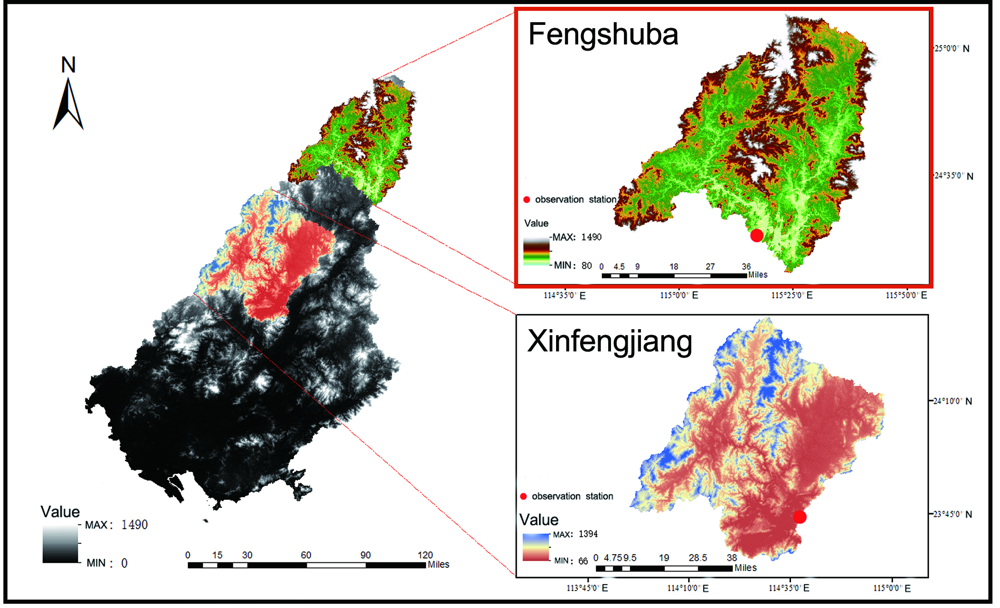
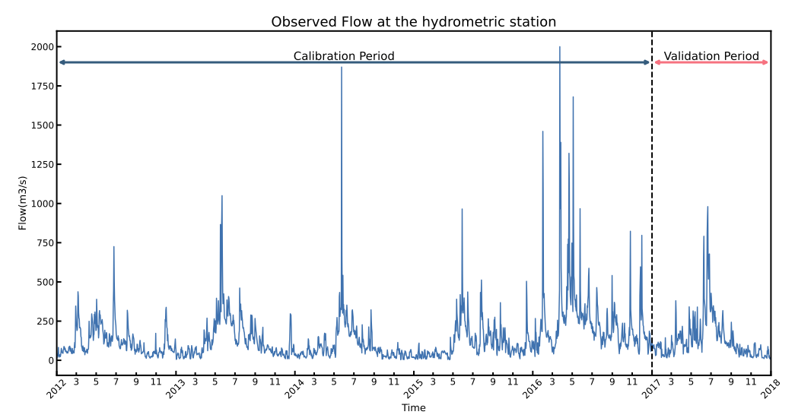
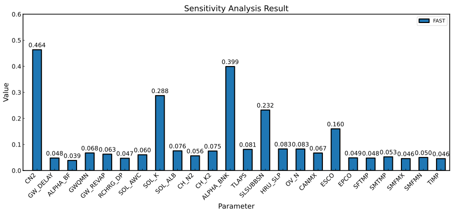
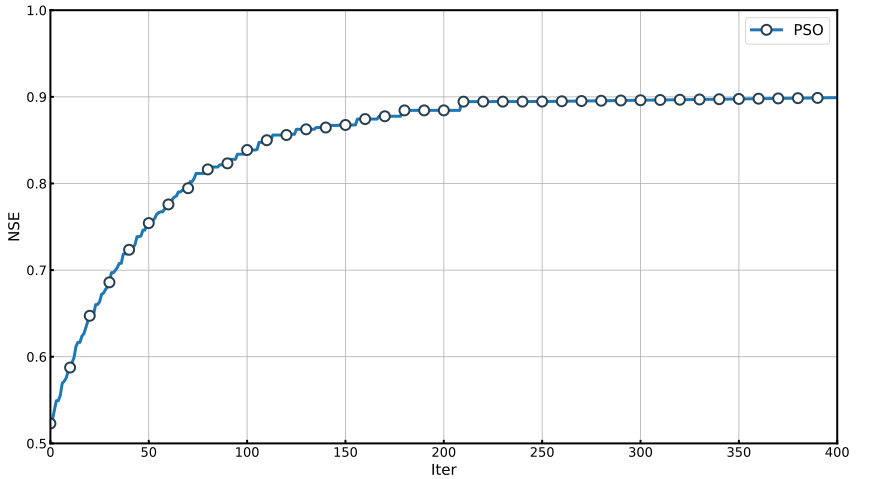

# 示例 1：东江流域的径流校准

---

## 背景介绍

广东的东江流域是一个重要的淡水水源地，面积超过 35,000 平方公里，为广州、深圳、香港等多个大城市提供供水。

本研究选取东江流域的两个子流域——丰水坝（Fengshuba）与新丰江（XinFengJiang）作为径流校准的案例。

我们主要展示丰水坝子流域的校准过程，其汇水面积为 5,150 平方公里，年均降雨量为 1,581 毫米。为了帮助用户熟悉 SWAT-UQ，提供了新丰江子流域的校准作为额外练习。

<figure align="center">
  
</figure>

---

## SWAT 模型构建

在构建丰水坝子流域的 SWAT 模型时，所用数据包括：

- **DEM（数字高程模型）** - 使用 ASTER GDEM，空间分辨率为 30 米  
- **土地利用数据** - 来自中国资源与环境科学数据中心（RESDC）  
- **土壤数据** - 来自世界统一土壤数据库（HWSD）  
- **气象数据** - 使用 CMADS（中国气象驱动数据集）  
- **观测数据** - 来自《水文年鉴》的径流数据（2008 年 1 月 1 日至 2017 年 12 月 31 日）

模型运行时间段如下：

- **预热期**：2008 年 1 月 1 日至 2011 年 12 月 31 日  
- **校准期**：2012 年 1 月 1 日至 2016 年 12 月 31 日  
- **验证期**：2017 年 1 月 1 日至 2017 年 12 月 31 日  

<figure align="center">
  
</figure>

💡 **提示：** [点击此链接下载项目文件](https://github.com/smasky/SWAT-UQ/raw/main/example/example1/project_FSB.zip)

---

## 问题定义

问题定义是将实际问题抽象成数学和代码可处理的问题的过程。

在本案例中，我们的目标是校准 SWAT 模型，使其输出结果尽可能接近观测数据。首先需选定用于评估模型表现的指标。在水文学中，常见的指标包括 NSE、R²、KGE、RMSE、PCC 等。这里我们采用 **NSE** 作为评估指标。

因此，实际问题可以抽象为如下形式：

<figure align="center">
  
</figure>

其中：
- $x$：SWAT 模型中待确定的参数  
- $NSE(\cdot)$：NSE 指标函数  
- $sim$：模型仿真结果  
- $ob$：观测数据  
- $lb$ 与 $ub$：参数的上下限

基于该抽象问题，我们可以在 SWAT-UQ 中使用代码表示与求解。

---

## 敏感性分析

我们首先为 SWAT 模型进行敏感性分析（SA）。参考 SWAT 手册和 [Liu 等人 (2017)](https://www.sciencedirect.com/science/article/pii/S0022169417305851) 的研究，选取了以下参数：

（参数表略，此处不重复）

准备参数文件：

文件名：`paras_sa.par`

```txt
Name Mode Type Min_Max Scope
CN2 r f -0.4_0.2 all
GW_DELAY v f 30_450 all
ALPHA_BF v f 0.0_1.0 all
GWQMN v f 0.0_500.0 all
GW_REVAP v f 0.02_0.20 all
RCHRG_DP v f 0.0_1.0 all
SOL_AWC r f 0.5_1.5 all
SOL_K r f 0.5_15.0 all
SOL_ALB r f 0.01_5.00 all
CH_N2 v f -0.01_0.30 all
CH_K2 v f  -0.01_500.0 all
ALPHA_BNK v f 0.05_1.00 all
TLAPS v f -10.0_10.0 all
SLSUBSSN r f 0.05_25.0 all
HRU_SLP r f 0.50_1.50 all
OV_N r f 0.10_15.00 all
CANMX v f 0.0_100.0 all
ESCO v f 0.01_1.00 all
EPCO v f 0.01_1.00 all
SFTMP v f -5.0_5.0 all
SMTMP v f -5.0_5.0 all
SMFMX v f 0.0_20.0 all
SMFMN v f 0.0_20.0 all
TIMP v f 0.01_1.00 all
```

准备目标函数文件：

文件名：`obj_sa.evl`

```txt
SER_1 : ID of series data
OBJ_1 : ID of objective function
WGT_1.0 : Weight of series combination
RCH_23 : ID of RCH, or SUB, or HRU
COL_2 : Extract Variable. The 'NUM' is differences with *.rch, *.sub, *.hru.
FUNC_1 : Func Type ( 1 - NSE, 2 - RMSE, 3 - PCC, 4 - Pbias, 5 - KGE, 6 - Mean, 7 - Sum, 8 - Max, 9 - Min )

1	2012 1 1	38.6
2	2012 1 2	16.2
3	2012 1 3	24.5
4	2012 1 4	26.9
5	2012 1 5	56.2
6	2012 1 6	82.1
7	2012 1 7	32.8
8	2012 1 8	20.5
9	2012 1 9	32.3
10	2012 1 10	28.9
11	2012 1 11	36.5
...
...
...
1821	2016 12 25	94.8
1822	2016 12 26	106
1823	2016 12 27	135
1824	2016 12 28	87.4
1825	2016 12 29	81.5
1826	2016 12 30	94.9
1827	2016 12 31	89.9
```

💡 **提示：** [点击此链接下载相关文件](https://github.com/smasky/SWAT-UQ/raw/main/example/example1/sa.zip)

基于该文件，SWAT-UQ 将从 `output.rch` 中提取 2012 至 2016 年 Reach 23 的数据，并使用 NSE 评估模型性能。

然后使用 Python 脚本运行分析：

```python
from swat_uq import SWAT_UQ
# 初始化 SWAT-UQ 问题
problem = SWAT_UQ(...)

from UQPyL.sensibility import FAST
fast = FAST()
X = fast.sample(problem, N=512)
Y = problem.objFunc(X)
res = fast.analyze(X, Y)
print(res)
```

最终结果（FAST 分析）如下图所示：

<figure align="center">
  
</figure>

选取前 10 个灵敏参数用于后续优化：CN2、ALPHA_BNK、SOL_K、SLSUBSSN、ESCO、HRU_SLP、OV_N、TLAPS、SOL_ALB、CH_K2。

---

## 参数优化

基于敏感性分析结果，我们创建新的参数文件：

文件名：`para_op.par`（内容略）

目标函数文件可与敏感性分析共用，但推荐另存为 `obj_op.evl`

💡 **提示：** [点击此链接下载相关文件](https://github.com/smasky/SWAT-UQ/raw/main/example/example1/op.zip)

Python 脚本示例：

```python
from swat_uq import SWAT_UQ
from UQPyL.optimization import PSO

problem = SWAT_UQ(...)
pso = PSO(nPop=50, maxFEs=30000, verboseFlag=True, saveFlag=True)
pso.run(problem)
```

优化结果如下：

<figure align="center">
  
</figure>

最优参数（NSE≈0.88）如下表：

| CN2 | SOL_K | SOL_ALB | CH_K2 | ALPHA_BNK | TLAPS | SLSUBSSN | HRU_SLP | OV_N | ESCO |
|-----|--------|----------|--------|------------|--------|------------|-----------|--------|-------|
| -0.236 | 14.278 | 0.325 | 46.604 | 1.000 | -5.532 | 1.611 | 0.515 | 3.162 | 0.010 |

---

## 验证

接下来，我们使用最优参数进行模型验证。

准备验证期的目标函数文件 `val_op.evl`（2017 年数据）

Python 验证示例：

```python
X = np.array([...])  # 最优参数值
res = problem.validate_parameters(X, valFile="val_op.evl")
print(res["objs"])
```

---

## 后处理

除了敏感性分析与优化，SWAT-UQ 还支持从输出中提取时间序列数据：

```python
X = np.array([...])
attr = problem.extract_series(X, seriesFile="series.evl")
simData = attr['objSeries'][1][1]['sim']
obData = attr['objSeries'][1][1]['obs']
```

---

## 应用最优解至项目

```python
X = np.array([...])
problem.apply_parameters(X, replace=False)  # 不改动原始项目
# 或：
problem.apply_parameters(X, replace=True)  # 覆盖原始项目（不推荐）
```

至此，模型校准工作完成。

---

## 用户练习

我们提供了新丰江子流域的完整练习项目：

👉 [点击此处下载项目文件](https://github.com/smasky/SWAT-UQ/raw/main/example/example1/project_XFJ.zip)

观测数据在 `observed.txt` 文件中。

如有任何问题，欢迎联系我们！